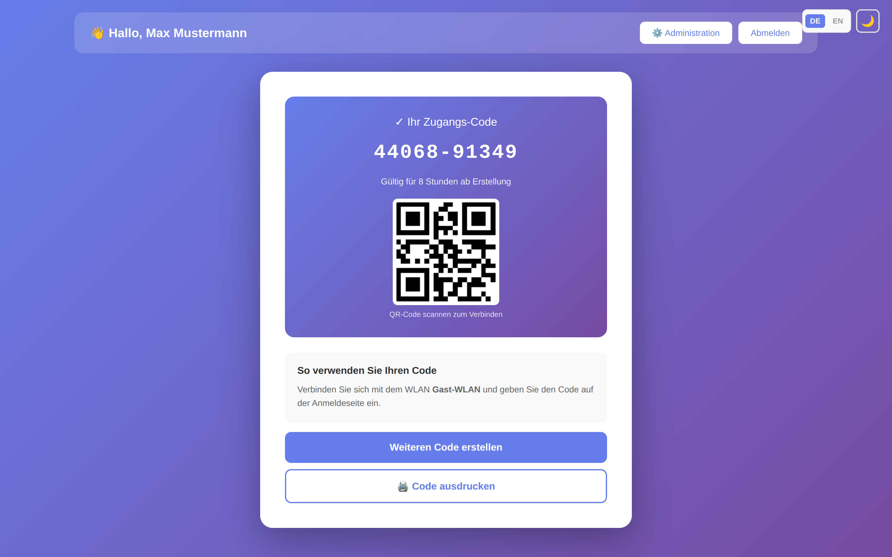
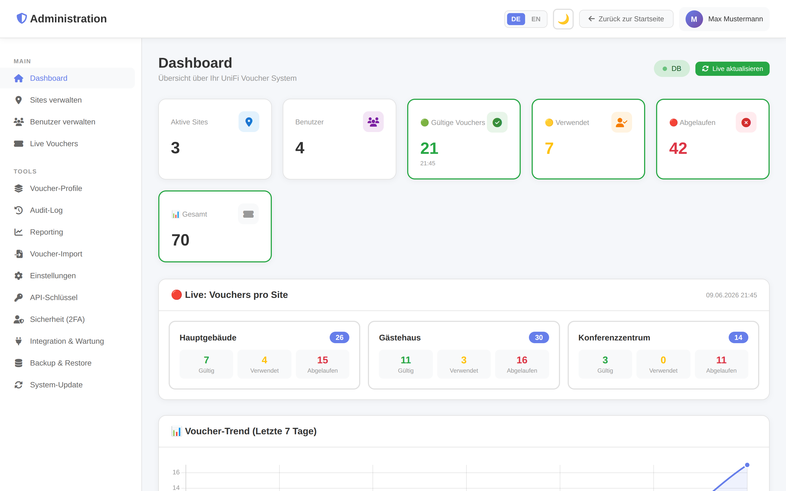
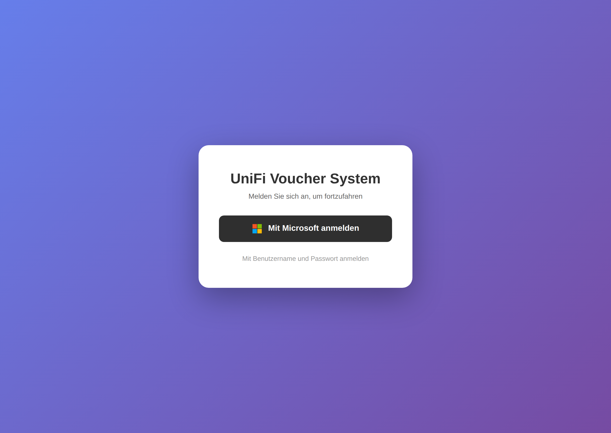
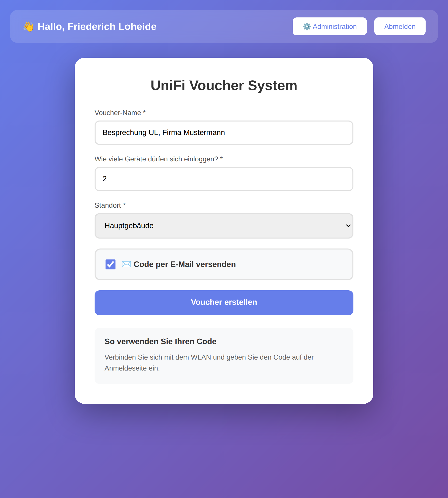
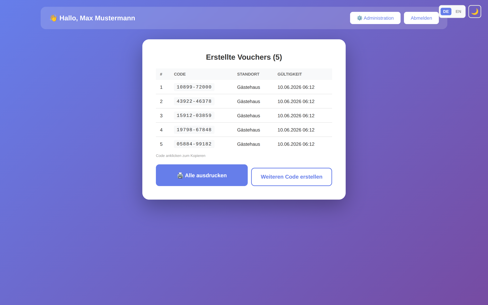
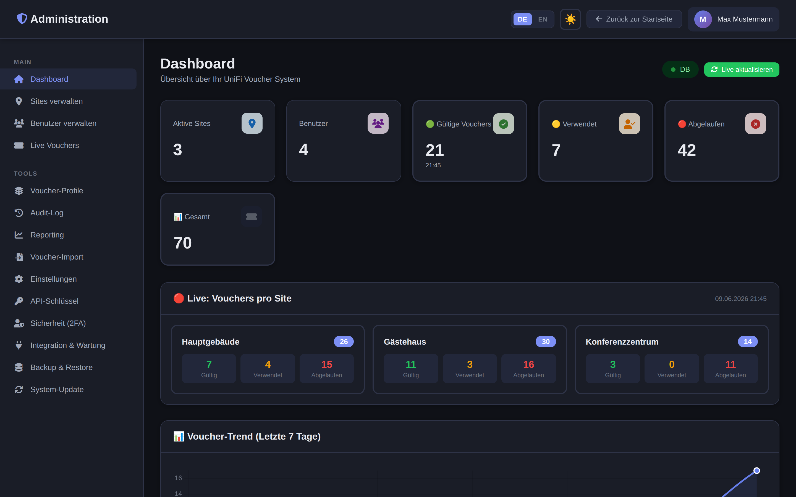
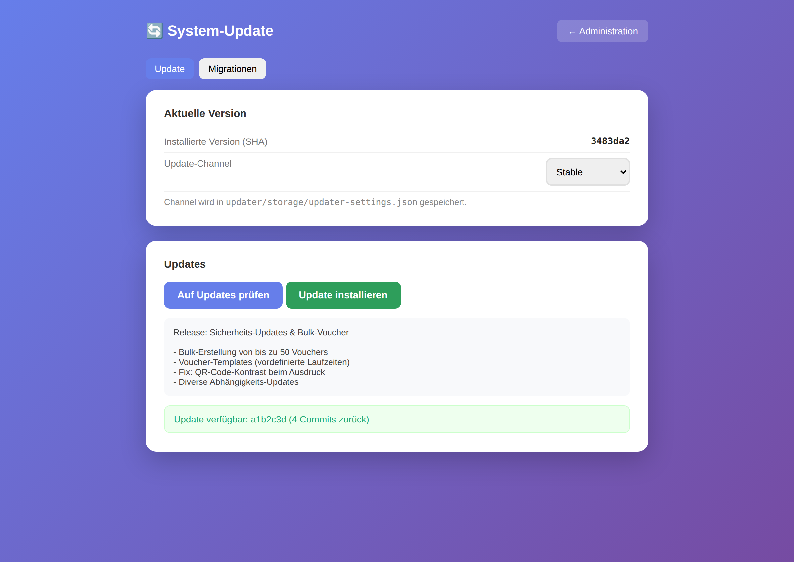
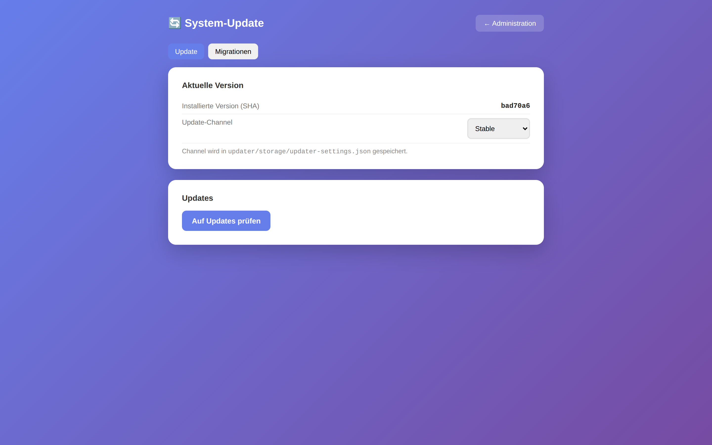
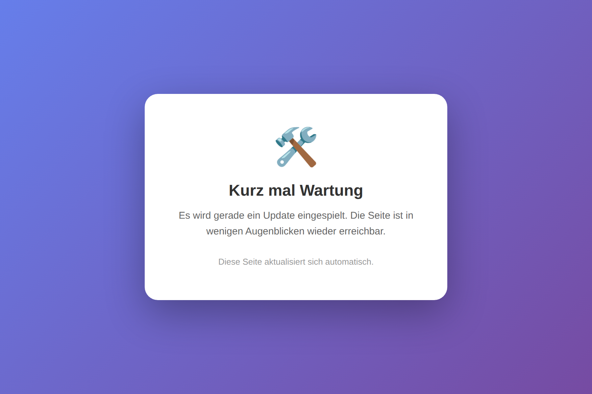

<div align="center">

# 🎫 UniFi Voucher Management System

**Webbasiertes WLAN-Voucher-Management für UniFi OS** – mit Multi-Site-Support, Benutzerverwaltung, Microsoft-365-Login und integriertem Auto-Updater.


</div>

---

<div align="center">
  
  
</div>

---

## ✨ Features

- 🎟️ **Voucher-Erstellung** mit sofortiger QR-Code-Anzeige, Druckvorlage und E-Mail-Versand
- 📦 **Bulk-Erstellung** – bis zu 20 Vouchers auf einmal, inkl. Sammeldruck-Layout
- 🧩 **Voucher-Profile/Templates** – vordefinierte Laufzeiten & Gerätelimits per Schnellauswahl
- 🏢 **Multi-Site-Support** – beliebig viele UniFi-Standorte zentral verwalten
- 👥 **Benutzerverwaltung** mit granularer Site-Zugriffskontrolle
- 🔐 **Authentifizierung** via lokale Accounts **oder** Microsoft 365 OAuth
- 🔒 **2FA (TOTP)** – optionale Zwei-Faktor-Authentifizierung für lokale Accounts
- 🔑 **Passwort-Reset** per E-Mail (token-basiert, zeitlich begrenzt)
- 🚦 **Bandbreiten- & Datenlimits** pro Voucher/Profil (UniFi QoS)
- 🧰 **REST-API mit API-Schlüsseln** – Voucher programmatisch erstellen
- 🔔 **Webhooks** (Slack / Teams / generisch) bei Voucher-Erstellung
- 🧹 **Auto-Cleanup & DSGVO** – Aufbewahrungsfristen per Cron
- 💾 **Config-Backup & -Restore** (JSON Export/Import)
- 🐳 **Docker** – Dockerfile + docker-compose (MariaDB)
- 🌍 **Öffentlicher Modus** – optional ohne Login nutzbar (mit CSRF-Schutz & Throttle)
- 🌗 **Dark Mode** – umschaltbar, Einstellung wird im Browser gespeichert
- 🌐 **Mehrsprachig** – Deutsch / Englisch per Umschalter (`lang/`)
- 📱 **Responsive Admin-Layout** mit Hamburger-Menü & Sidebar-Overlay
- 📊 **Admin-Dashboard** mit Live-Statistiken und Sync-Funktion
- 📝 **Audit-Log** – nachvollziehbare Protokollierung von Login & Änderungen (mit Filter)
- 📥 **CSV-Export** aller Vouchers pro Site
- 🔄 **Integrierter Auto-Updater** – Updates & DB-Migrationen per Klick aus dem Admin-Bereich
- 🛡️ **Security-by-default**: CSRF-Schutz, bcrypt-Passwörter, Prepared Statements,
  Login-Rate-Limiting, OAuth-State-Validierung, Verschlüsselung sensibler Daten

---

## 📸 Screenshots

### Anmeldung & Voucher-Erstellung

<div align="center">
  
  
  
</div>

### Bulk-Erstellung & Dark Mode

<div align="center">
  
  
</div>

### Administration & Updater

<div align="center">
  
  
</div>

<div align="center">
  
  
</div>

---

## 📋 Anforderungen

| Komponente | Version |
|---|---|
| PHP | 7.4+ (mit PDO, PDO_MySQL, cURL, mbstring, JSON; empfohlen: OpenSSL/libsodium, Zip) |
| Datenbank | MySQL 5.7+ / MariaDB 10.2+ |
| Webserver | Apache / Nginx |
| UniFi | **Network Application 7.0+ mit UniFi OS** (z. B. UDM, UDR, UniFi OS Server) |

---

## 🚀 Installation

```bash
git clone https://github.com/friloo/unifi-voucher-tool.git
cd unifi-voucher-tool
```

1. Dateien auf den Webserver hochladen
2. `https://ihre-domain.de/install.php` öffnen
3. Den **5-Schritte-Assistenten** durchlaufen:
   1. Datenbank-Verbindungsdaten
   2. Administrator-Account
   3. Allgemeine Einstellungen (Titel, Logo, öffentlicher Zugriff)
   4. Microsoft 365 Integration (optional)
   5. Installation abschließen
4. `install.php` nach erfolgreicher Installation **löschen**

> 🔒 Der Installer erzeugt automatisch einen zufälligen `APP_KEY` (für die
> Verschlüsselung der UniFi-Passwörter) und eine `.htaccess`, die sensible
> Dateien sperrt. Ein erneuter Aufruf von `install.php?reinstall=1` ist nur
> für **angemeldete Administratoren** möglich.

### Sites konfigurieren

1. **Administration → Sites verwalten → Neue Site hinzufügen**
2. Felder ausfüllen:
   - **Name:** Anzeigename (z. B. „Hauptgebäude")
   - **Site ID:** UniFi Site ID (meist `default`)
   - **Controller URL:** `https://unifi.example.com:11443`
   - **Benutzername / Passwort:** UniFi Admin-Zugangsdaten
3. **Verbindung testen** klicken, dann speichern

### Voucher erstellen

1. Startseite öffnen (Login je nach Konfiguration optional)
2. Voucher-Name, Anzahl Geräte und Standort wählen
3. **Voucher erstellen** – Code und QR-Code werden sofort angezeigt
4. Code per E-Mail senden oder ausdrucken

---

## 🔄 Auto-Updater

Das System bringt einen vollständig integrierten Updater mit, der Quellcode und
Datenbank-Migrationen über einen zentralen Update-Proxy nachzieht – ganz ohne
SSH oder manuelles `git pull`.

```
[diese Instanz]  ←HTTPS→  [Update-Proxy]  ←pull→  [Git-Repo]
```

**Aufruf:** Administration → **System-Update** (`/admin/update.php`)

- 🔍 **„Auf Updates prüfen"** zeigt verfügbare Versionen inkl. Changelog
- ⬇️ **„Update installieren"** spielt das Update ein – mit Wartungsseite,
  geschützten Pfaden (`config.php`, Uploads, …), automatischen DB-Migrationen
  und OPcache-Reset
- 🔀 **Channel-Auswahl** zwischen `stable` und `development`
- 📊 **Migrations-Status** in einem eigenen Tab – inkl. Button **„Ausstehende
  Migrationen ausführen"** (legt z. B. neue Tabellen für bestehende
  Installationen an, ohne dass ein Code-Update nötig ist)

Während eines Updates wird die Anwendung kurz in den **Wartungsmodus** versetzt:

<div align="center">
  
</div>

> Der Updater ist vollständig isoliert im Ordner [`updater/`](updater/) gekapselt.
> Details zur Architektur und eine Rückbau-Anleitung stehen in
> [`updater/README.md`](updater/README.md).

---

## ⚙️ Konfiguration

### `config.php`

Wird automatisch durch den Installer erstellt:

```php
<?php
define('DB_HOST', 'localhost');
define('DB_NAME', 'unifi_voucher');
define('DB_USER', 'username');
define('DB_PASS', 'password');
define('APP_KEY', '...');            // Schlüssel für Verschlüsselung-at-rest
define('SESSION_LIFETIME', 3600);    // Session-Timeout in Sekunden
date_default_timezone_set('Europe/Berlin');
```

### Microsoft 365 OAuth (optional)

1. Im [Azure Portal](https://portal.azure.com) eine App-Registrierung anlegen
2. Umleitungs-URI: `https://ihre-domain.de/m365_callback.php`
3. API-Berechtigungen: `openid`, `profile`, `email`, `User.Read`
4. Client ID, Client Secret und Tenant ID in **Administration → Einstellungen** eintragen

### Cron-Job (empfohlen)

Automatische Synchronisation alle 30 Minuten:

```bash
*/30 * * * * curl -s "https://ihre-domain.de/cron_sync.php?token=IHR_CRON_TOKEN"
```

Den Token finden Sie unter **Administration → Einstellungen → Cron**.

---

## 🛡️ Sicherheit

Das Tool ist auf einen sicheren Standardbetrieb ausgelegt:

| Schutz | Umsetzung |
|---|---|
| **Passwörter** | bcrypt (`password_hash`) für Accounts |
| **UniFi-Passwörter** | Verschlüsselt-at-rest (AES-256-GCM / libsodium) über `APP_KEY` |
| **SQL-Injection** | Durchgängig Prepared Statements (PDO) |
| **CSRF** | Token für alle schreibenden Aktionen – auch im öffentlichen Modus |
| **OAuth** | `state`-Validierung gegen Login-CSRF |
| **Brute-Force** | Login-Rate-Limiting + Throttle der öffentlichen Voucher-Erstellung |
| **Sessions** | HttpOnly, SameSite, strict mode + absolutes Timeout |
| **Fehler** | `display_errors` aus, `log_errors` an (kein Info-Leak) |

Empfohlene zusätzliche Härtung am Server:

```apache
# .htaccess – sensible Dateien sperren (wird vom Installer erzeugt)
<FilesMatch "^(config\.php|database\.sql|install\.php|test\.php|m365_debug\.php|.*\.md)$">
    Require all denied
</FilesMatch>
```

```sql
-- Dedizierter Datenbank-Benutzer mit minimalen Rechten
CREATE USER 'unifi_voucher'@'localhost' IDENTIFIED BY 'sicheres_passwort';
GRANT SELECT, INSERT, UPDATE, DELETE ON unifi_voucher.* TO 'unifi_voucher'@'localhost';
```

---

## 🩺 Problembehandlung

<details>
<summary><b>Login funktioniert nicht</b></summary>

- Datenbankverbindung und PHP-Session-Konfiguration prüfen
- Fehler werden ins PHP-Error-Log geschrieben (nicht mehr in den Browser)
</details>

<details>
<summary><b>UniFi-Verbindung schlägt fehl</b></summary>

- Controller-URL im Browser testen
- Port **11443** für UniFi OS verwenden (nicht 8443)
- Benutzername, Passwort und Site ID prüfen
- cURL-Extension muss aktiviert sein
</details>

<details>
<summary><b>UniFi OS: HTTP 404 oder 401</b></summary>

- Login-Endpunkt ist `/api/auth/login` (nicht `/api/login`)
- API-Pfade benötigen Präfix `/proxy/network/api/s/{site}/...`
- Älterer UniFi Network Controller (ohne UniFi OS) wird ab Version 2.1.0 nicht mehr unterstützt
</details>

<details>
<summary><b>Microsoft 365 Login funktioniert nicht</b></summary>

- Redirect URI in Azure AD prüfen
- Client ID, Secret und Tenant ID kontrollieren
- Diagnose unter `m365_debug.php` (nur als Admin erreichbar)
</details>

---

## 📡 API-Dokumentation (UniFi OS)

```http
# Login
POST /api/auth/login
Body: {"username": "admin", "password": "password"}
Response-Header: X-CSRF-Token: <token>

# Voucher erstellen
POST /proxy/network/api/s/{site_id}/cmd/hotspot
X-CSRF-Token: <token>
Body: {"cmd": "create-voucher", "expire": 480, "n": 1, "note": "Name", "quota": 1}

# Vouchers abrufen
GET /proxy/network/api/s/{site_id}/stat/voucher

# Voucher löschen
POST /proxy/network/api/s/{site_id}/cmd/hotspot
Body: {"cmd": "delete-voucher", "_id": "<voucher_id>"}
```

---

## 🧰 REST-API

Voucher lassen sich programmatisch erstellen (z. B. aus Buchungssystemen oder
Self-Service-Terminals). Schlüssel werden unter **Administration → API-Schlüssel**
verwaltet. Authentifizierung per `Authorization: Bearer <key>` oder `X-API-Key`.

```bash
# Voucher erstellen
curl -X POST https://ihre-domain.de/api/vouchers.php \
  -H "Authorization: Bearer uvt_…" \
  -H "Content-Type: application/json" \
  -d '{"site_id":1,"name":"API Gast","max_uses":1,"expire_minutes":480,
       "qos":{"down":10000,"up":2000,"quota_mb":500}}'

# Sites auflisten
curl https://ihre-domain.de/api/sites.php -H "X-API-Key: uvt_…"

# Voucher einer Site abrufen
curl "https://ihre-domain.de/api/vouchers.php?site_id=1" -H "X-API-Key: uvt_…"
```

| Methode | Endpunkt | Zweck |
|---|---|---|
| `POST` | `/api/vouchers.php` | Voucher erstellen (optional mit QoS-Limits) |
| `GET`  | `/api/vouchers.php?site_id=<id>` | Voucher einer Site auflisten |
| `GET`  | `/api/sites.php` | Aktive Sites auflisten |

## 🔒 2FA, Webhooks & Wartung

- **2FA:** Unter **Administration → Sicherheit (2FA)** aktivierbar – QR-Code
  scannen, Code bestätigen. Danach wird bei jeder Anmeldung ein Authenticator-
  Code abgefragt.
- **Webhooks & Trusted-Proxy & Datenhaltung:** unter **Administration →
  Integration & Wartung** konfigurierbar.
- **Auto-Cleanup (DSGVO):** täglicher Cron, löscht abgelaufene Voucher,
  Audit-Log, Login-Versuche nach einstellbaren Fristen:
  ```bash
  0 3 * * * curl -s "https://ihre-domain.de/cron_cleanup.php?token=IHR_CRON_TOKEN"
  ```

## 🐳 Docker

```bash
# APP_KEY erzeugen und in docker-compose.yml eintragen:
php -r 'echo base64_encode(random_bytes(32))."\n";'

docker compose up -d        # App auf http://localhost:8080
```

Das Schema wird beim ersten Start automatisch in MariaDB geladen; danach den
Installer (`/install.php`) für den Admin-Account aufrufen oder Config per ENV
setzen (`DB_*`, `APP_KEY`).

## 🗺️ Roadmap

- [x] Voucher-Templates (vordefinierte Laufzeiten)
- [x] Bulk-Voucher-Erstellung
- [x] Mehrsprachigkeit (DE/EN)
- [x] Dark Mode
- [x] Passwort-Reset
- [x] Audit-Log
- [x] Auto-Updater mit DB-Migrationen
- [x] REST-API mit API-Schlüsseln
- [x] 2FA (TOTP), Webhooks, Bandbreitenlimits
- [x] Docker-Container
- [ ] Erweiterte Reporting-Funktionen (PDF/Excel)

---

<div align="center">

**Version 2.2.0** · Autor: **Friederich Loheide** · Lizenz: **MIT**

</div>
